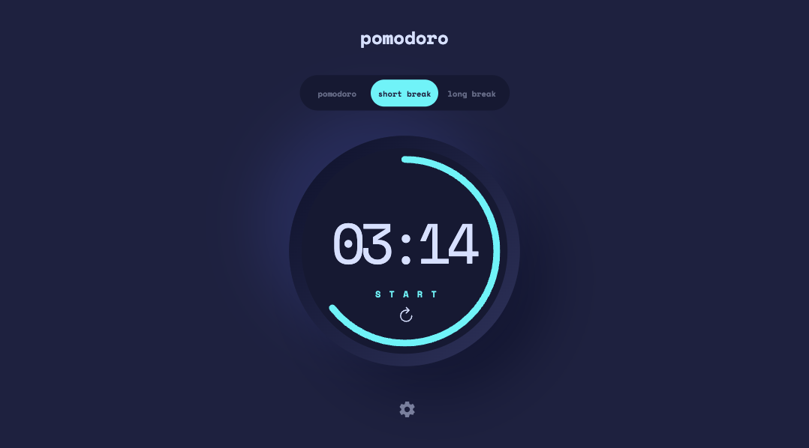
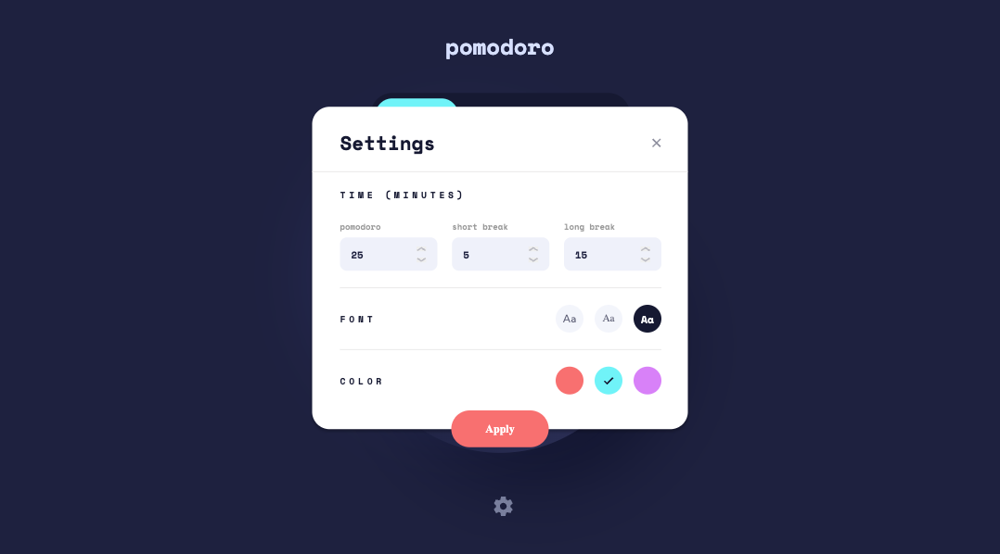

# Frontend Mentor - Pomodoro app solution

This is a solution to the [Pomodoro app challenge on Frontend Mentor](https://www.frontendmentor.io/challenges/pomodoro-app-KBFnycJ6G). Frontend Mentor challenges help you improve your coding skills by building realistic projects.

## Table of contents

-   [Overview](#overview)
    -   [The challenge](#the-challenge)
    -   [Screenshot](#screenshot)
    -   [Links](#links)
-   [My process](#my-process)
    -   [Built with](#built-with)
    -   [What I learned](#what-i-learned)
    -   [Continued development](#continued-development)
    -   [Useful resources](#useful-resources)
-   [Author](#author)
-   [Acknowledgments](#acknowledgments)

## Overview

As a recent graduate from the [CodingDojo](http://www.codingdojo.com), with highest honors in **Python** & **MERN** stacks, I wanted to find projects to work on to add to my portfolio.

I am loving the challenges at FrontEnd Mentor. You are provided with the challenge, minimum requirements, and any assets needed (to include Figma with payed professional plan). The goal is to showcase my capabilities of bringing a website/application to life using professional designs.

Although this isn't a full-stack application, I liked the challenge of creating a [Pomodoro](https://todoist.com/productivity-methods/pomodoro-technique) app as it is a productivity tool I have been using for years and I learned a lot about working with time in _JavaScript_.

### The challenge

Users should be able to:

-   Set a pomodoro timer and short & long break timers
-   Customize how long each timer runs for
-   See a circular progress bar that updates every minute and represents how far through their timer they are
-   Customize the appearance of the app with the ability to set preferences for colors and fonts

**I added one other feature**

-   Add a reset button to reset the timer
-   Settings save to local storage

### Screenshots





### Links

-   Solution URL: [https://www.frontendmentor.io/solutions/pomodoro-app-kQXxT0Mjhh](https://www.frontendmentor.io/solutions/pomodoro-app-kQXxT0Mjhh)
-   Live Site URL: [https://pomodoro.chrisnowicki.io](https://pomodoro.chriswix.com)

## My process

1. Develop the look and feel of the site without the functionality of the application. This includes the responsive design.
2. Code the functionality of the application
3. Refactor code into reusable components as either javascript utilities (_helper files_) or custom React Hooks.

### Built with

-   [Vitejs](https://vitejs.dev) - Development Environment
-   [React](https://reactjs.org/) - JS library
-   [Sass](https://sass-lang.com) - CSS library
-   [TypeScript](https://www.typescriptlang.org/) - JS Library

### What I learned

I wanted to use this project to learn how to write in **TypeScript**, create custom **React Hooks**, and write css using **Sass**. There were also unexpected areas that I learned when it comes to using **React Context**.

**Custom Hook**
I wrote the useActive hook for the navigation buttons and Font/Color settings buttons to check if the current selected button is active.

```js
export function useActive(item: string, itemCompare: string): boolean {
    if (item !== itemCompare) return false

    return true
}
```

**SCSS Mixin**
I wrote this breakpoint mixin to reference across my css code for the responsible design. The mixin takes in a `$size`(_string_) and references `$breakpoint-up` for which size to use in the media query. This way I only need to make updates to the mixin and it will change throughout the project.

```scss
$breakpoint-up: (
    'mobile': 591px,
    'tablet': 1000px,
);

@mixin breakpoint($size) {
    @media (max-width: map-get($breakpoint-up, $size)) {
        @content;
    }
}
```

**Example of SCSS code referencing the mixin**

```scss
/* variables */
@use '/src/styles/vars' as *;
@use '/src/styles/breakpoints' as *;

.clockContainer {
    display: flex;
    direction: column;
    justify-content: center;
    align-items: center;
    width: 410px;
    height: 410px;
    border-radius: 50%;
    background: $clock-linear-gradient;
    box-shadow: $clock-box-shadow;
    margin-top: 45px;
    transition: all ease 0.3s;

    @include breakpoint(tablet) {
        margin-top: 109px;
    }

    @include breakpoint(mobile) {
        width: 300px;
        height: 300px;
        margin-top: 48px;
    }
}
```

### Continued development

I want to continue to focus on a few things:

1. SCSS/SASS - Learn more about nesting, functions, and mixins.
2. TypeScript - I learned so much in this project but I feel I have so much more to learn to become fluent.

Additional Features I'd like to add into this project:

[] - Create functionality to have the user select an option in settings to automatically have the short/long breaks start.
[] - Create functionally to have the user choose how many pomodoro rotations until a long break occurs. Typically 4 is used by default.

### Useful resources

-   [React/React Native Countdown Circle Timer](https://github.com/chris-nowicki/react-countdown-circle-timer) - Excellent repo that I used for the circle countdown progress bar.
-   [Vite](https://vitejs.dev/)
-   [TypeScript](https://www.typescriptlang.org/)
-   [React TypeScript Cheatsheets](https://react-typescript-cheatsheet.netlify.app/)

## Author

-   Website - [https://www.chrisnowicki.io](https://www.chrisnowicki.io)
-   Frontend Mentor - [@chris-nowicki](https://www.frontendmentor.io/profile/chris-nowicki)
-   Twitter - [@iamwix](https://www.twitter.com/iamwix)

## Acknowledgments

Some credit definitely goes to [Kens-Visuals](https://github.com/kens-visuals/markdown-notes-app). Since this was my first project using TypeScript I did some research on how others wrote the Types for this specific app/challenge in React. I came across [Ken's Solution](https://www.frontendmentor.io/solutions/pomodoro-pwa-built-w-nextjs-typescript-tailwind-and-framer-motion-OByffa8eQw) and was impressed. I definitely learned a ton about TypeScript and Context through his solution.
